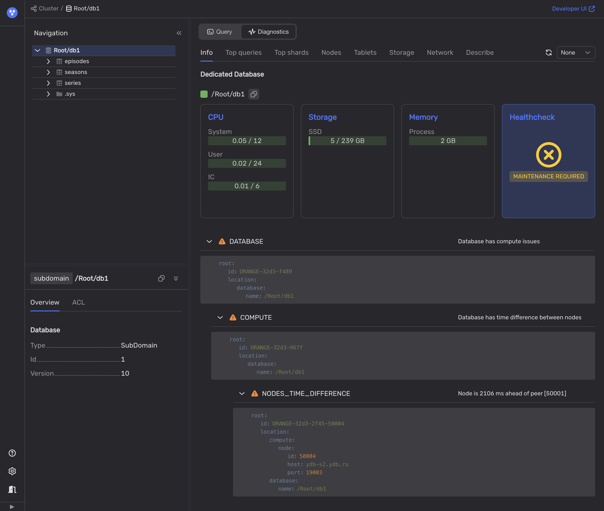

# System clock drift

Synchronized clocks are critical for distributed databases. If system clocks on the {{ ydb-short-name }} servers drift excessively, distributed transactions will experience increased latencies.

If a {{ ydb-short-name }} cluster contains multiple [coordinators](../../../../concepts/glossary.md#coordinator), planned transactions are merged by [mediators](../../../../concepts/glossary.md#mediator) before being sent off for execution.

If the system clocks of the nodes running the coordinator tablets differ, transaction latencies increase by the time difference between the fastest and slowest system clocks. This occurs because a transaction planned on a node with a faster system clock can only be executed once the coordinator with the slowest clock reaches the same time.

Furthermore, if the system clock drift exceeds 30 seconds, {{ ydb-short-name }} will refuse to process distributed transactions. Before coordinators start planning a transaction, affected DataShards determine an acceptable range of timestamps for the transaction. The start of this range is the current time of the mediator tablet's clock, while the 30-second planning timeout determines the end. If the coordinator's system clock exceeds this time range, it cannot plan a distributed transaction for the DataShard, resulting in errors for such queries.

## Diagnostics

To diagnose the system clock drift, use [Embedded UI](../../../../reference/embedded-ui/index.md):

1. In the [Embedded UI](../../../../reference/embedded-ui/index.md), go to the **Databases** tab and click on the database.

1. On the **Navigation** tab, ensure the required database is selected.

1. Open the **Diagnostics** tab.

1. On the **Info** tab, click the **Healthcheck** button.

    If the **Healthcheck** button displays a `MAINTENANCE REQUIRED` status, the {{ ydb-short-name }} cluster might have problems, such as system clock drift. Any identified issues will be listed in the **DATABASE** section beneath the **Healthcheck** button.

1. To see the diagnosed problems, expand the **DATABASE** section.

    

    The system clock drift problems will be listed under `NODES_TIME_DIFFERENCE`.



You can also use the following methods to diagnose system clock drift:

- Open the [Interconnect overview](../../../../reference/embedded-ui/interconnect-overview.md) page of the [Embedded UI](../../../../reference/embedded-ui/index.md).

- Use such tools as `pssh` or `ansible` to run the command on all {{ ydb-short-name }} nodes to display the system clock value.



## Recommendations

1. Sync the system clocks of {{ ydb-short-name }} nodes manually. For example, you can use `pssh` or `ansible` to run the clock sync command on all of the nodes.

1. Ensure that system clocks on all of the {{ ydb-short-name }} servers are synced by `ntpd` or `chrony`. It's recommended to use the same time source for all servers in the {{ ydb-short-name }} cluster.
