# Overloaded shard example

You were notified that your system started taking too long to process user requests.

## Initial problem

Let's take a look at the **Latency** diagrams in the [DB overview](../../reference/observability/metrics/grafana-dashboards.md#dboverview) Grafana dashboard to see if the problem has to do with the {{ ydb-short-name }} cluster:


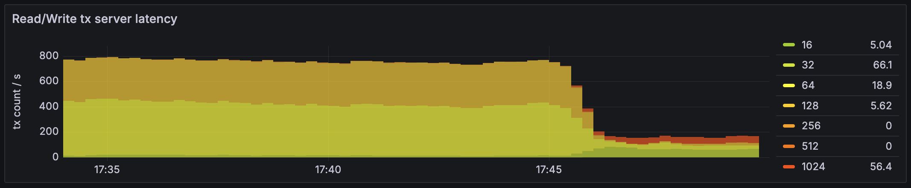

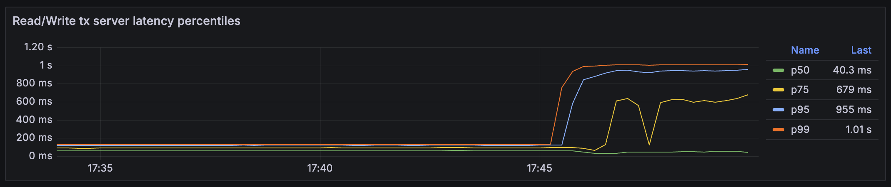

Indeed, the latencies have increased. Now we need to localize the problem.

## Diagnostics

Let's find out the reason for the latencies to increase. Perhaps, the reason is the increased workload? Here is the **API details** section of the [DB overview](../../reference/observability/metrics/grafana-dashboards.md#dboverview) Grafana dashboard:

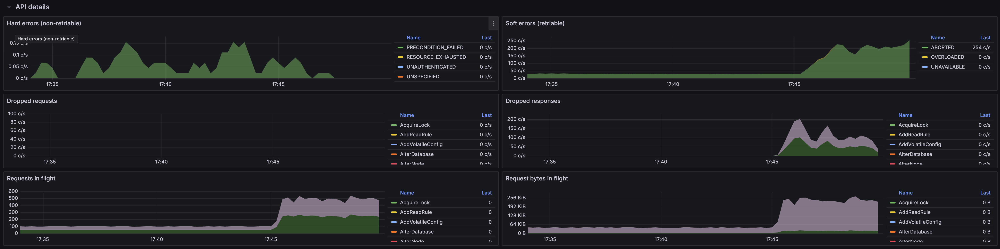

The number of user requests has definetely increased. But can {{ ydb-short-name }} handle the increased load without additional hardware resources? See the CPU Grafana dashboard:

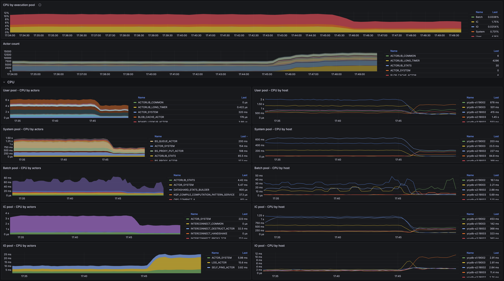

We can also see the overall CPU usage on the **Diagnostics** tab of the [Embedded UI](../../reference/embedded-ui/index.md):

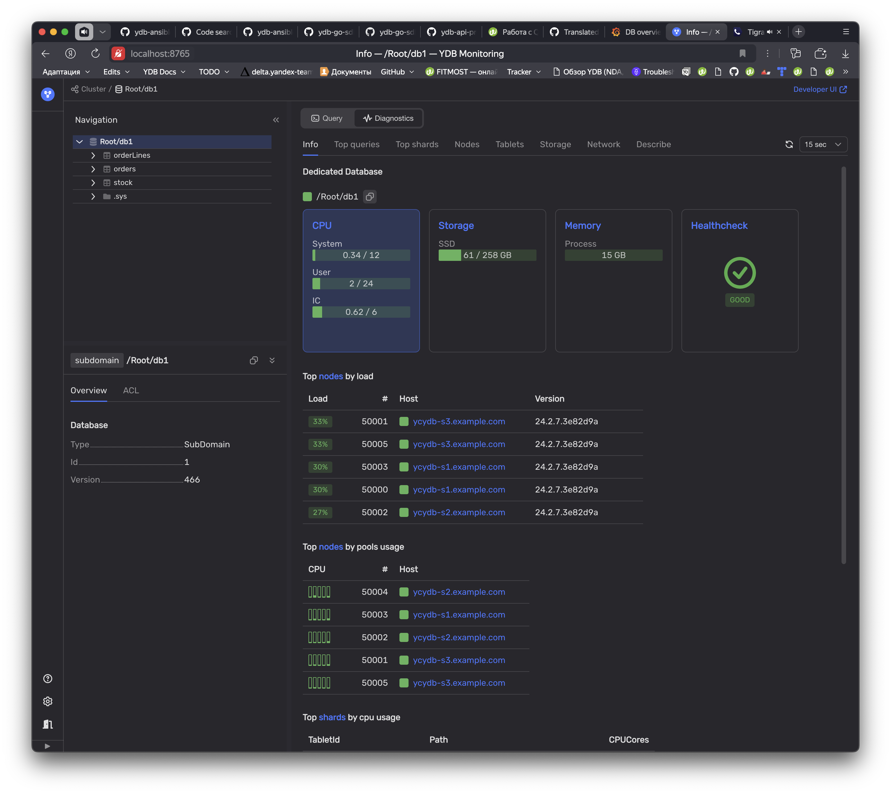

It looks like the {{ ydb-short-name }} cluster is not utilizing all of its cpu capacity.

If we look at the **DataShard** section [DB overview](../../reference/observability/metrics/grafana-dashboards.md#dboverview) Grafana dashboard? we can see that after the load on the cluster increased, one of its data shards got overloaded.

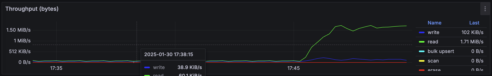

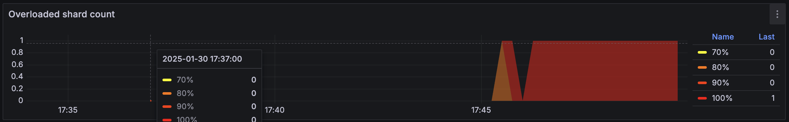

To determine what table the overloaded data shard is processing, let's open the **Diagnostics > Top shards** tab in the Embedded UI:

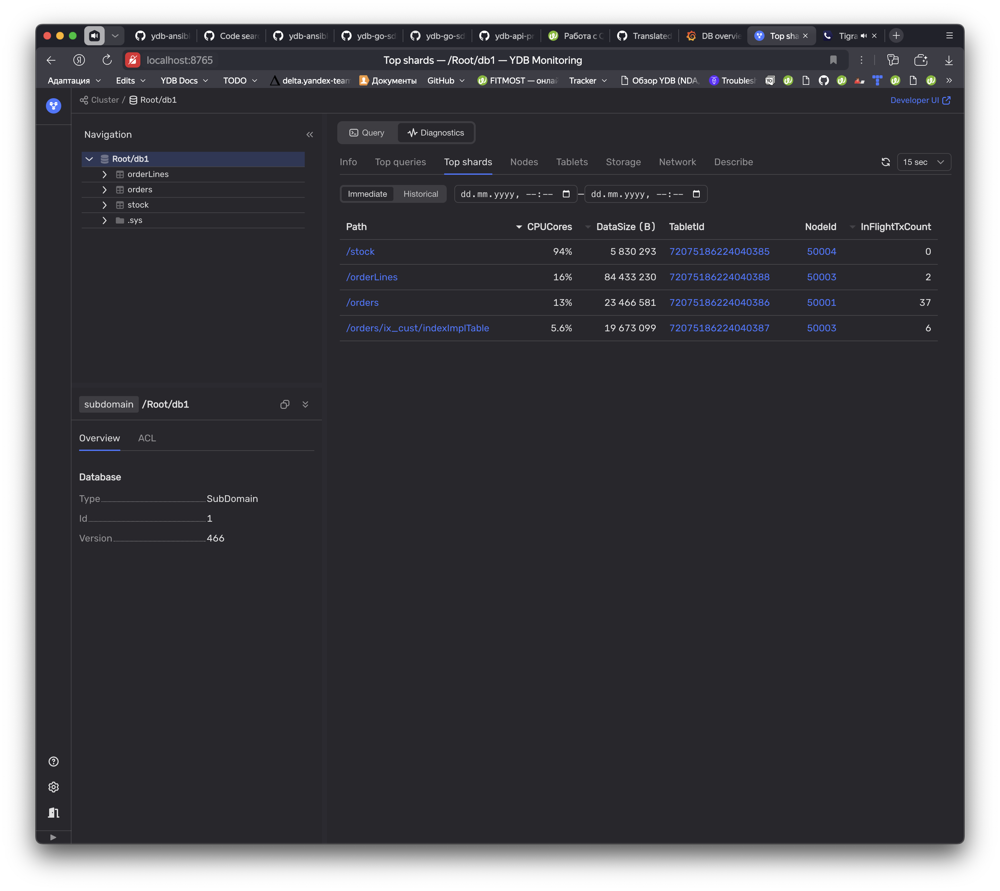

See that one of data shards that processes queries for the `stock` table is loaded by 94%.

Let's take a look at the `stock` table on the **Info** tab:

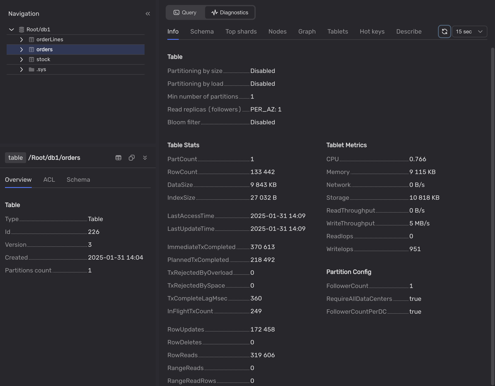



The `stock` table was created with partitioning by size and by load disabled and has only one partition.

It means that only one data shard processes requests to this talbe. And we know that a data shard can process only one request at a time. This is really bad practice.



## Solution

We should enable partitioning by size and by load for the `stock` table:

1. In the Embedded UI, select the database.
2. Open the **Query** tab.
3. Run the following query:

    ```sql
    ALTER TABLE stock SET (
        AUTO_PARTITIONING_BY_SIZE = ENABLED,
        AUTO_PARTITIONING_BY_LOAD = ENABLED
    );
    ```

## Aftermath

As soon as we enable automatic partitioning for the `stock` table, the overloaded data shard start splitting.

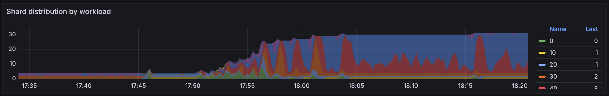

In five minutes the number of data shards processing the table stabilizes. Multiple data shards are processing queries to the `stock` table now, none of them are overloaded:

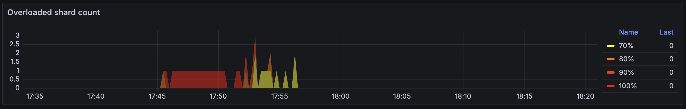

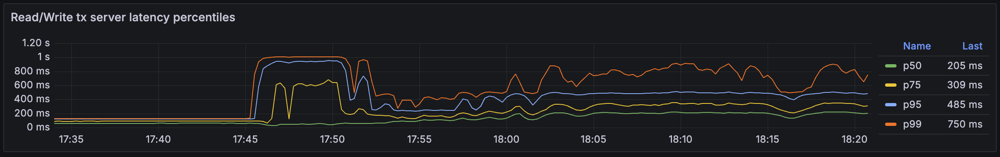
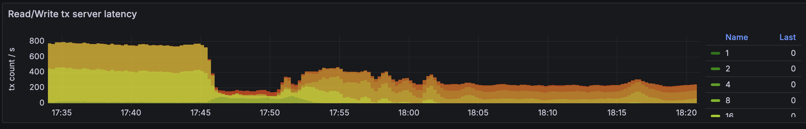
