# Пример диагностики перегруженных шардов и нехватки ресурса CPU

Как и в [предыдущей статье](./overloaded-shard-simple-case.md), здесь мы рассматривает пример диагностики перегруженных шардов и решения этой проблемы. Но в этом случае ситуация осложняется недостатком ресурсов CPU.

Дополнительную информацию о проблемах, диагностируемых в этой статье, смотри в следующих материалах:

- [{#T}](../../performance/schemas/overloaded-shards.md);
- [{#T}](../../performance/hardware/cpu-bottleneck.md).

Статья начинается с [описания возникшей проблемы](#initial-issue). Затем мы проанализируем графики в Grafana и информацию на вкладке **Diagnostics** в [Embedded UI](../../../reference/embedded-ui/index.md), чтобы [найти решение](#solution), и проверим [его эффективность](#aftermath).

В конце статьи приводятся шаги по [воспроизведению проблемы](#testbed).

## Описание проблемы {#initial-issue}

Вас уведомили о задержках при обработке пользовательских запросов в вашей системе.



Речь идёт о запросах к [строковой таблице](../../../concepts/datamodel/table.md#row-oriented-tables), управляемой [data shard](../../../concepts/glossary.md#data-shard)'ом.



Рассмотрим графики **Latency** на панели мониторинга Grafana [DB overview](../../../reference/observability/metrics/grafana-dashboards.md#dboverview) и определим, имеет ли отношение наша проблема к кластеру {{ ydb-short-name }}:

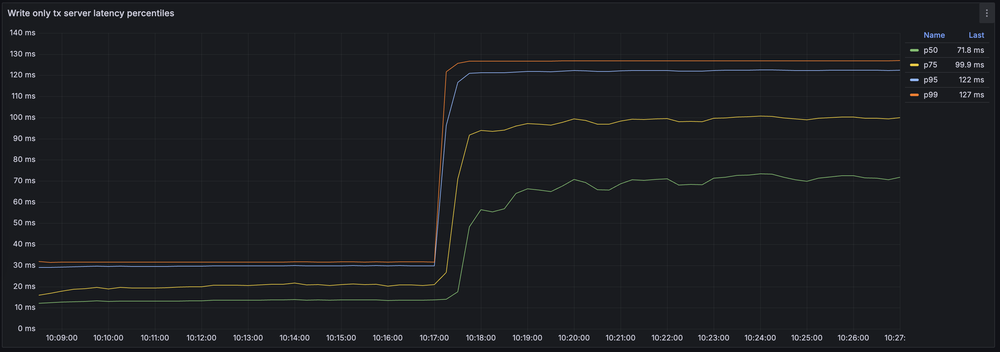



График отображает процентили задержек транзакций. Примерно в ##10:19:30## эти значения выросли в два-три раза.



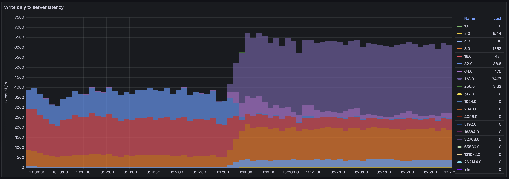



График отображает процентили задержек транзакций. Примерно в ##10:19:30## эти значения выросли в два-три раза.



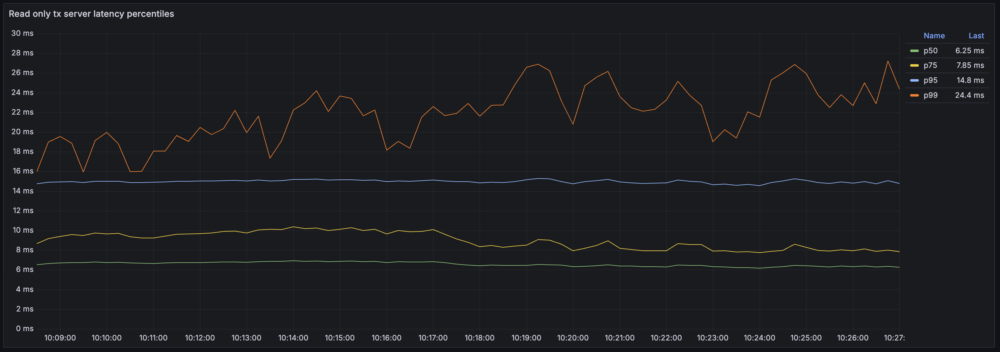



График отображает тепловую карту (heatmap) задержек транзакций. Транзакции группируются на основании их задержек, каждая группа (bucket) окрашивается в свой цвет. Таким образом, этот график показывает как количество транзакций, обрабатываемых {{ ydb-short-name }} в секунду (по вертикальной оси), так и распределение задержек среди транзакций (цветовая дифференциация).

К ##10:20:30## доля транзакций с минимальными задержками (`Группа 1`, тёмно-зелёный) упала в четыре-пять раз. `Группа 4` выросла примерно в пять раз, а также выделилась новая группа транзакций с ещё более высокими задержками — `Группа 8`.



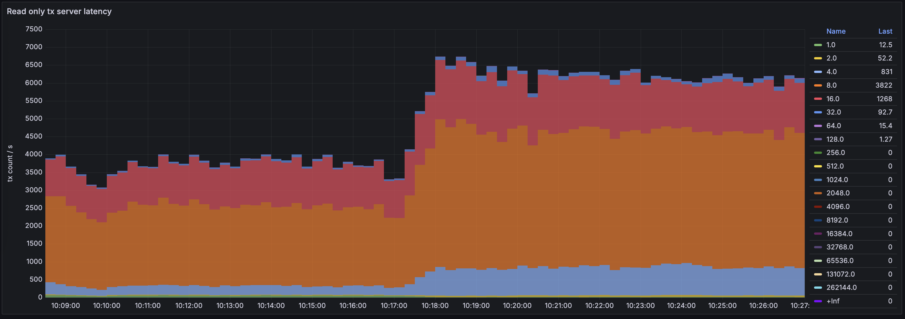



График отображает тепловую карту (heatmap) задержек транзакций. Транзакции группируются на основании их задержек, каждая группа (bucket) окрашивается в свой цвет. Таким образом, этот график показывает как количество транзакций, обрабатываемых {{ ydb-short-name }} в секунду (по вертикальной оси), так и распределение задержек среди транзакций (цветовая дифференциация).

К ##10:20:30## доля транзакций с минимальными задержками (`Группа 1`, тёмно-зелёный) упала в четыре-пять раз. `Группа 4` выросла примерно в пять раз, а также выделилась новая группа транзакций с ещё более высокими задержками — `Группа 8`.



Таким образом, мы видим, что задержки действительно выросли. Теперь нам необходимо локализовать проблему.

## Диагностика {#diagnostics}

Давайте определим причину роста задержек. Могли ли они увеличиться из-за возросшей нагрузки? Посмотрим на график **Requests** в секции **API details** панели мониторинга Grafana [DB overview](../../../reference/observability/metrics/grafana-dashboards.md#dboverview):

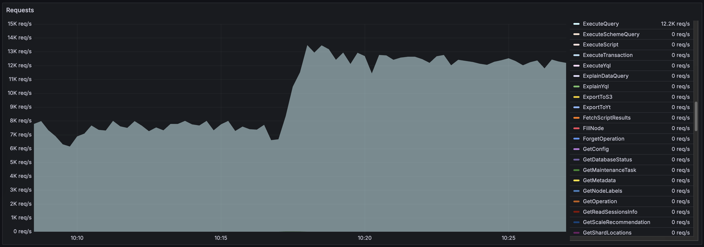

Количество пользовательских запросов выросло приблизительно с 27 000 до 35 000 в ##10:20:00##. Но может ли {{ ydb-short-name }} справиться с увеличившейся нагрузкой без дополнительных аппаратных ресурсов?

Загрузка CPU увеличилась, что видно на графике **CPU by execution pool**.

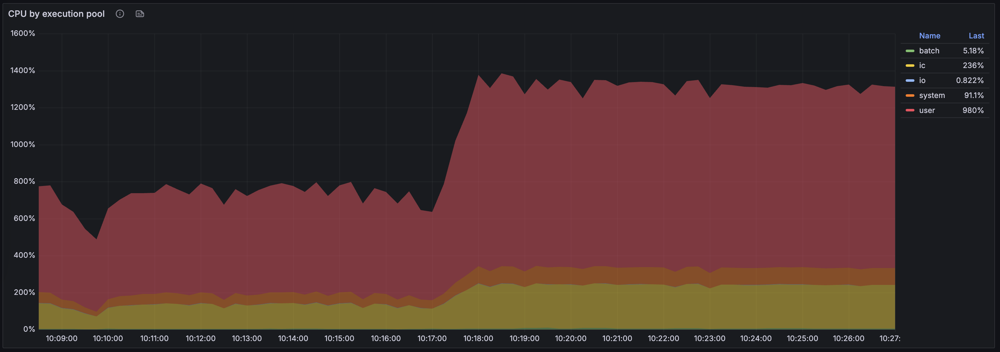

Мы видим рост нагрузки на CPU [в пуле ресурсов пользователей (красный) и интерконнекта (жёлтый)](../../../concepts/glossary.md#actor-system-pool)

Мы также можем взглянуть на общее использование CPU на вкладке **Diagnostics** в [Embedded UI](../../../reference/embedded-ui/index.md):

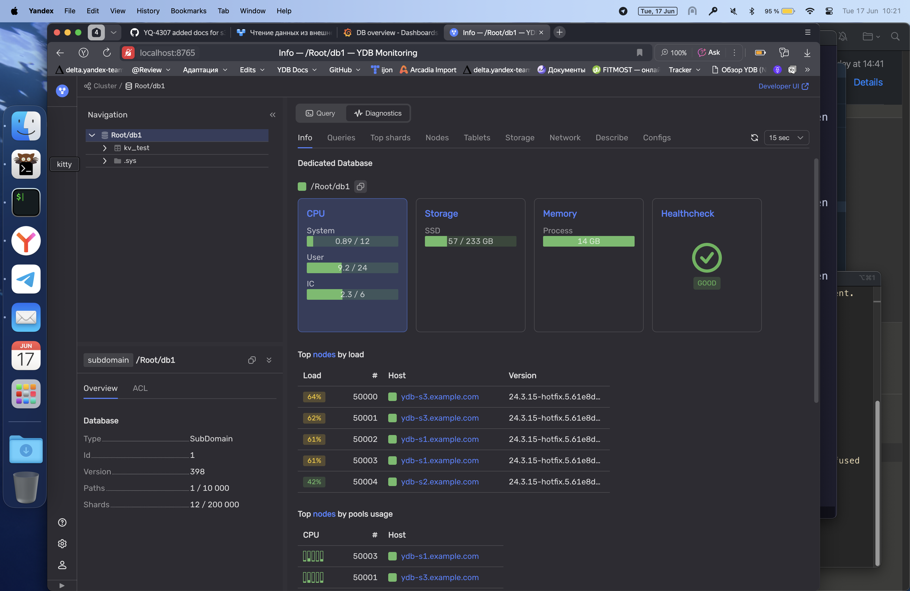

Кластер {{ ydb-short-name }} не использует все ресурсы CPU.

Взглянув на секции **DataShard** и **DataShard details** на панели мониторинга Grafana [DB overview](../../../reference/observability/metrics/grafana-dashboards.md#dboverview), мы увидим, что после роста нагрузки на кластер один из data shard'ов был перегружен.

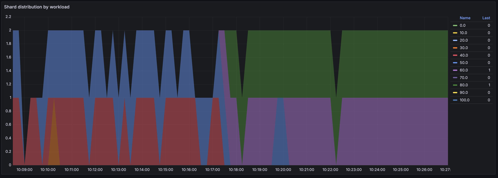



Этот график отображает тепловую карту распределения data shard'ов по нагрузке. Каждый data shard потребляет от 0% до 100% ядра CPU. Data shard'ы делятся на десять групп по занимаемой ими доле ядра CPU — 0-10%, 10-20% и т.д. Эта тепловая карта показывает количество data shard'ов в каждой группе.

График показывает только один data shard, нагрузка на который изменилась примерно в ##10:19:30## — data shard перешёл в `Группу 70`, содержащую шарды, нагруженные на 60–70%.



Чтобы определить, какую таблицу обслуживает перегруженный data shard, откроем вкладку **Diagnostics > Top shards** во встроенном UI:

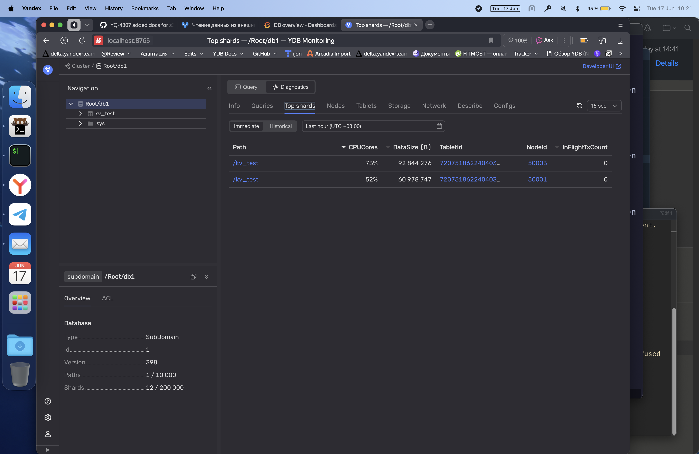

Мы видим, что один из data shard'ов, обслуживающих таблицу `kv_test`, нагружен на 67%.

Далее давайте взглянем на информацию о таблице `kv_test` на вкладке **Info**:

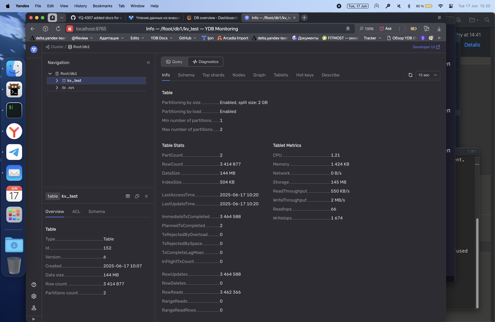



Таблица `kv_test` была создана с отключённым партиционированием по нагрузке и содержит только одну партицию.

Это означает, что все запросы к этой таблице обрабатывает один data shard. Учитывая, что data shard'ы — это однопоточные компоненты, обрабатывающие за раз только один запрос, такой подход неэффективен.



## Решение {#solution}

Нам необходимо включить партиционирование по нагрузке для таблицы `kv_test`:

1. Во встроенном UI выберите базу данных.
2. Откройте вкладку **Query**.
3. Выполните следующий запрос:

    ```yql
    ALTER TABLE kv_test SET (
        AUTO_PARTITIONING_BY_LOAD = ENABLED
    );
    ```

## Результат {#aftermath}

После включения автоматического партиционирования для таблицы `kv_test` перегруженный data shard разделился на два.

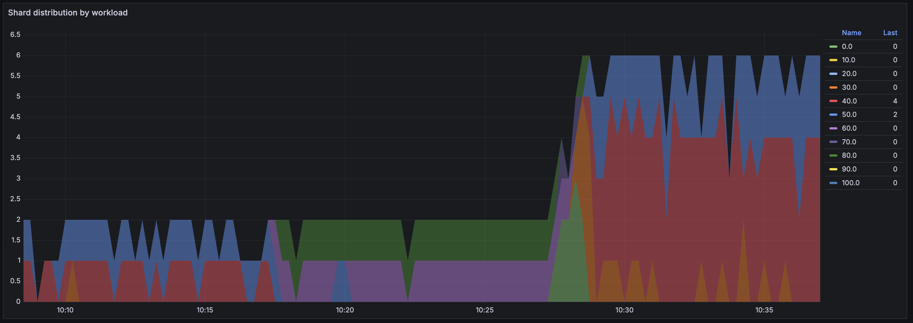



График показывает, что количество data shard'ов выросло примерно в ##10:28:00##. Судя по цвету групп, их нагрузка не превышает 40%.



Теперь шесть data shard'ов обрабатывают запросы к таблице `kv_test`, и ни один из них не перегружен:

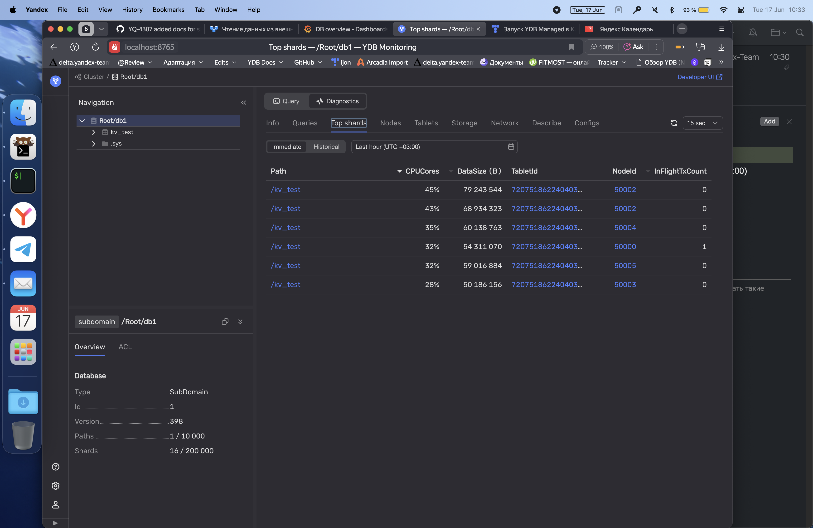

Давайте убедимся, что задержки транзакций вернулись к прежним значениям:

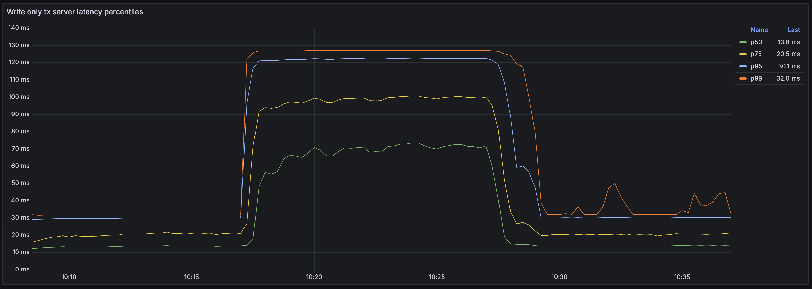



Примерно в ##10:28:00## процентили задержек p50, p75 и p95 упали практически до прежних значений. Задержки p99 сократились не настолько значительно, но всё же уменьшились в два раза.



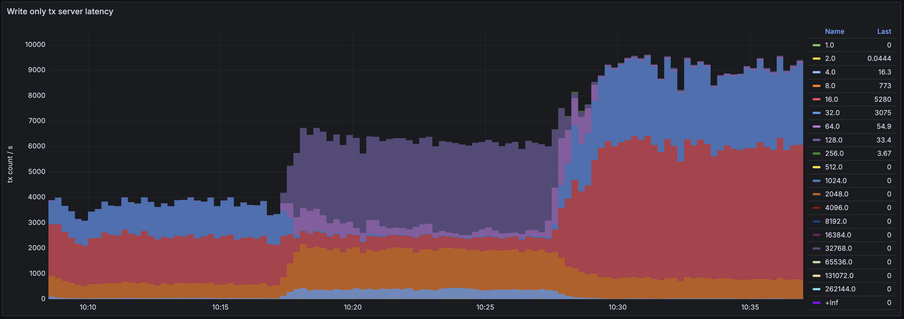



Транзакции на этом графике теперь распределены по шести группам. Примерно половина транзакций вернулась в `Группу 1`, то есть их задержки не превышают одной миллисекунды. Более трети транзакций находятся в `Группе 2` с задержками от одной до двух миллисекунд. Одна шестая транзакций — в `Группе 4`. Размеры остальных групп незначительны.



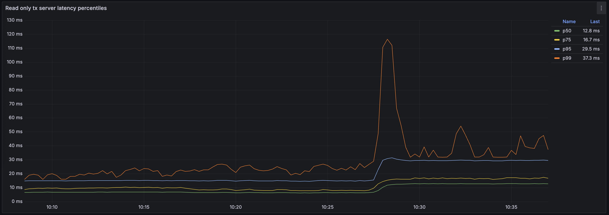

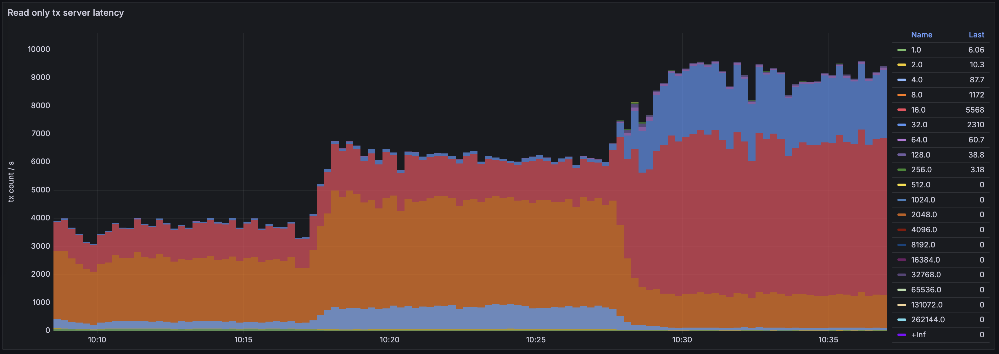

Задержки практически вернулись к уровню до увеличения нагрузки. При этом мы не увеличили расходы на приобретение дополнительных аппаратных ресурсов, а просто включили автоматическое партиционирование по нагрузке, что позволило более эффективно использовать доступные ресурсы.

#|
|| Имя группы
| Задержки, мс
|
Один перегруженный data shard,
транзакций в секунду
|
Несколько data shard'ов,
транзакций в секунду
||
|| 1
| 0-1
| 2110
| <span style="color:teal">▲</span> 16961
||
|| 2
| 1-2
| 5472
| <span style="color:teal">▲</span> 13147
||
|| 4
| 2-4
| 16437
| <span style="color:navy">▼</span> 6041
||
|| 8
| 4-8
| 9430
| <span style="color:navy">▼</span> 432
||
|| 16
| 8-16
| 98.8
| <span style="color:navy">▼</span> 52.4
||
|| 32
| 16-32
| —
| <span style="color:teal">▲</span> 0.578
||
|#

## Описание второй проблемы

Однако, если мы откроем диагностику во встроенном UI, то мы увидим предупреждение о том, что кластеру {{ ydb-short-name }} не хватает ресурсов процессора в пользовательском пуле:

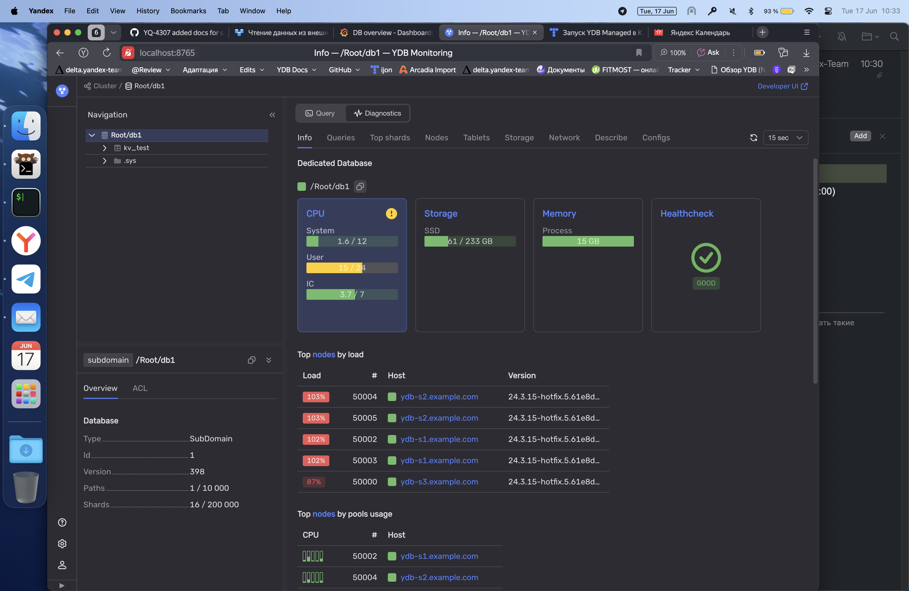

## Диагностика проблемы с нехваткой ресурсов CPU

Загрузка CPU еще раз увеличилась, что видно на графике **CPU by execution pool**.

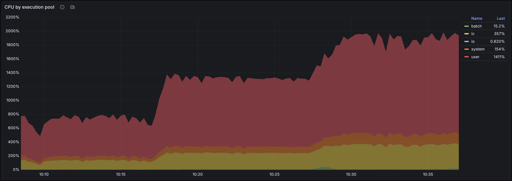

Количество пользовательских запросов выросло приблизительно с 27 000 до 35 000 в 10:20:00.

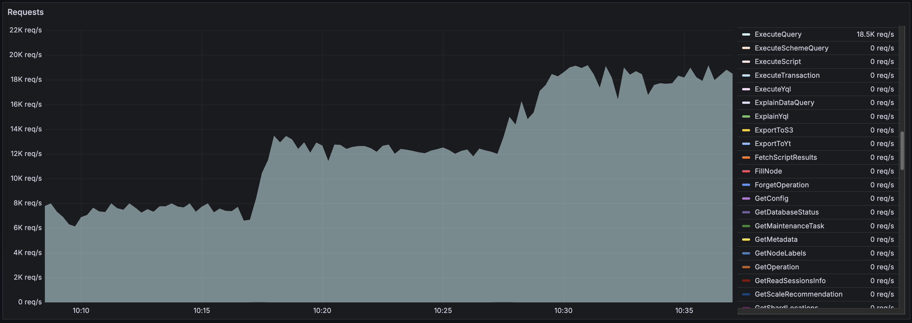

## Решение проблемы с нехваткой ресурсов CPU

TODO: Как узнать, хватает ли ядер на сервере, какие рекомендации?

Проблему недостатка ресурсов CPU можно решить несколькими способами:

- Увеличить количество ядер для серверов, на которых запущены узлы {{ ydb-short-name }}.
- Увеличить количество ядер, доступных акторной системе узлов кластера {{ ydb-short-name }}, в конфигурации кластера.
- Добавить новые узлы в кластер {{ ydb-short-name }}.

В нашем примере на серверах {{ ydb-short-name }} добавлено достаточно ядер CPU. Поэтому достаточно будет увеличить количество ядер в пуле ресурсов узлов кластера {{ ydb-short-name }} на каждом сервере:

1. Открыть файл конфигурации `/opt/ydb/cfg/ydbd-config-dynamic.yaml` в текстовом редакторе:

    ```shell
    sudo vim /opt/ydb/cfg/ydbd-config-dynamic.yaml
    ```

2. Увеличить количество ядер в параметре `cpu_count` раздела `actor_system_config`:

    ```yaml
    actor_system_config:
        use_auto_config: true
        node_type: COMPUTE
        cpu_count: 16
    ```

3. Перезапустить узлы YDB, чтобы применить новую конфигурацию.

## Тестовый стенд {#testbed}

### Топология

Для этого примера мы использовали кластер {{ ydb-short-name }} из трёх серверов на Ubuntu 22.04 LTS. На каждом сервере был запущен один [узел хранения](../../../concepts/glossary.md#storage-node) и три [узла баз данных](../../../concepts/glossary.md#database-node), обслуживающих одну и ту же базу данных.

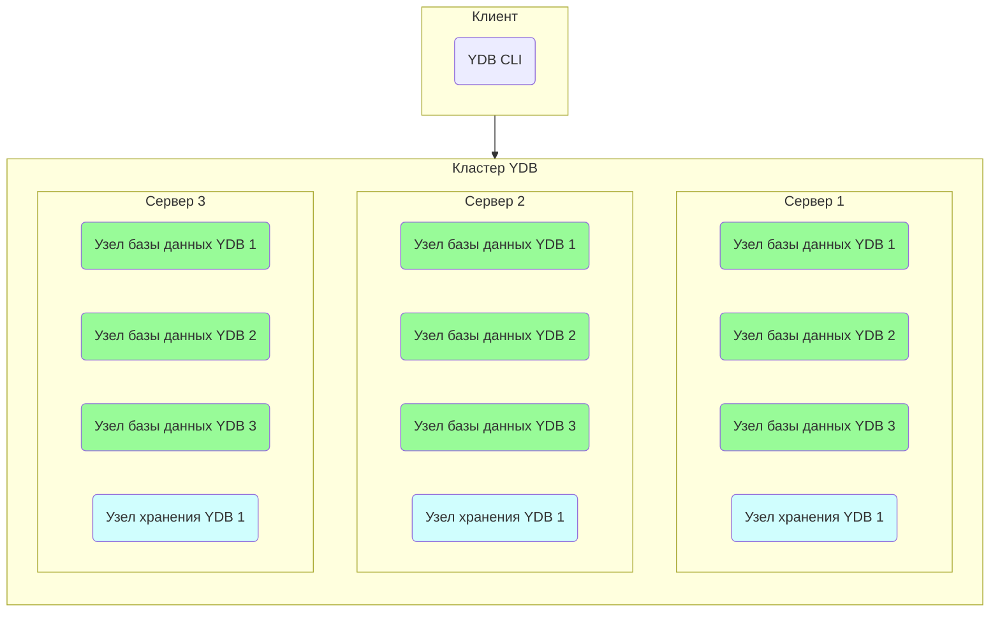

### Аппаратная конфигурация

Аппаратные ресурсы серверов (виртуальных машин) приведены ниже:

- Платформа: Intel Broadwell
- Гарантированный уровень производительности vCPU: 100%
- vCPU: 28
- Память: 32 GB
- Диски:
    - 3 × 93 GB SSD на каждом узле {{ ydb-short-name }}
    - 20 GB HDD для операционной системы


### Тест

Нагрузка на кластер {{ ydb-short-name }} была запущена с помощью команды CLI `ydb workload`. Дополнительную информацию см. в статье [{#T}](../../../reference/ydb-cli/commands/workload/index.md).

Чтобы воспроизвести нагрузку, выполните следующие шаги:

1. Проинициализируйте таблицы для нагрузочного тестирования:

    ```shell
    ydb workload kv init --min-partitions 1 --auto-partition 0
    ```

    Мы намеренно отключаем автоматическое партиционирование для создаваемых таблиц используя опции `--min-partitions 1 --auto-partition 0`.

1. Воспроизведите стандартную нагрузку на кластер {{ ydb-short-name }}:

    ```shell
    ydb workload kv run select -s 600 -t 100
    ```

    Мы запустили простую нагрузку, используя базу данных {{ ydb-short-name }} как Key-Value хранилище. Точнее, мы использовали нагрузку `select` для выполнения `SELECT`-запросов, возвращающих строки по точному совпадению primary ключа.

    Параметр `-t 100` используется для запуска нагрузочного тестирования в 100 потоков.

3. Создайте перегрузку на кластере {{ ydb-short-name }}:

    ```shell
    ydb workload kv run select -s 1200 -t 250
    ```

    Как только первый тест завершился, мы немедленно запустили тот же самый тест в 250 потоков, чтобы создать перегрузку.

## Смотрите также

- [{#T}](../../performance/index.md)
- [{#T}](../../performance/schemas/overloaded-shards.md)
- [{#T}](../../../concepts/datamodel/table.md#row-oriented-tables)
